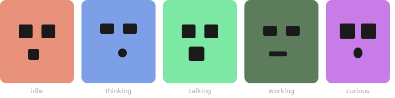

# 🤖 Clawd Face

A real-time animated face for your AI assistant. Watch Claude think, talk, browse, and code — like a Tamagotchi for your terminal.

  

<p align="center">
  
</p>

## ✨ Features

- **15 emotional states** — idle, thinking, talking, working, curious, and more
- **Real-time sync** — 50ms polling, instant feedback
- **Smart detection** — knows when Claude is thinking vs talking vs coding
- **Mouse tracking** — eyes follow your cursor
- **Easter eggs** — type "dance", "love", "matrix" or try the Konami code
- **Auto-sleep** — face sleeps after 5min, click to wake

## 🚀 Quick Start (Let Claude Do It!)

**Just tell your Claude:**

> Setup clawd-face for me. Clone https://github.com/martinbon39/clawd-face-react, install, configure the watcher to read my Clawdbot sessions, and run with pm2. Then help me setup a Cloudflare tunnel.

**That's it.** Your Claude will handle the rest.

---

## 📖 Manual Setup

### Requirements

- **Node.js 18+**
- **Clawdbot** running on the same server
- **pm2** (recommended): `npm install -g pm2`
- **Cloudflare account** (free) for tunnel

### 1. Install

```bash
# Clone
git clone https://github.com/martinbon39/clawd-face-react.git
cd clawd-face-react

# Install & build
npm install
npm run build
```

### 2. Configure

The watcher needs to know where your Clawdbot sessions are:

```bash
# Default path (usually works)
~/.clawdbot/agents/main/sessions/sessions.json

# Or set custom path
export SESSIONS_FILE=/path/to/sessions.json
```

### 3. Run

```bash
cd watcher

# Start watcher (monitors Clawdbot activity)
pm2 start watcher.js --name clawd-face-watcher

# Start server (serves the face)
pm2 start server.js --name clawd-face-server

pm2 save
```

Face is now at: `http://localhost:3333`

### 4. Expose to Internet (Cloudflare Tunnel)

```bash
# Create tunnel
cloudflared tunnel create clawd-face

# Edit ~/.cloudflared/config.yml
tunnel: <your-tunnel-id>
credentials-file: ~/.cloudflared/<tunnel-id>.json
ingress:
  - hostname: face.yourdomain.com
    service: http://localhost:3333
  - service: http_status:404

# Run tunnel
pm2 start "cloudflared tunnel run clawd-face" --name clawd-face-tunnel
pm2 save
```

### 5. Secure with Cloudflare Access (Recommended)

The face shows what your AI is doing. Protect it:

1. Go to [Cloudflare Zero Trust](https://one.dash.cloudflare.com)
2. **Access** → **Applications** → **Add Application**
3. Add your hostname (e.g., `face.yourdomain.com`)
4. Create policy: **Allow** → **Emails** → your email
5. Now only you can access the face 🔐

---

## 🏗️ Architecture

```
Your Server (where Clawdbot runs)
┌────────────────────────────────────────┐
│                                        │
│  Clawdbot ──writes──▶ sessions/*.jsonl │
│                           │            │
│                     watcher.js         │
│                      (polls 50ms)      │
│                           │            │
│                      state.json        │
│                           │            │
│                     server.js :3333    │
│                           │            │
│                     cloudflared        │
│                           │            │
└───────────────────────────┼────────────┘
                            │
                            ▼
                    face.yourdomain.com
                            │
                            ▼
                      Your Browser 🖥️
```

**Important:** The watcher must run on the **same server** as Clawdbot because it reads local session files.

---

## 🎭 States

| State | Color | Trigger |
|-------|-------|---------|
| 😐 idle | Coral | Nothing happening |
| 🎧 listening | Light green | User sent a message |
| 🤔 thinking | Blue | Claude is reasoning |
| 💬 talking | Green | Claude is responding |
| 💻 working | Dark green | Running commands |
| 🔍 curious | Purple | Reading files/searching |
| 🎯 focused | Navy | Browsing/editing |
| ⚡ processing | Indigo | Waiting for results |
| 😴 sleeping | Dark | 5min inactivity |

---

## 🥚 Easter Eggs

| Trigger | Effect |
|---------|--------|
| Type `dance` | 🎵 Dance animation |
| Type `love` | ❤️ Hearts |
| Type `hello` | 👋 Wave |
| Type `matrix` | 💚 Matrix mode |
| `↑↑↓↓←→←→BA` | ⭐ Konami! |
| Click 3× | Dance |
| Click 10× | 🌈 Rainbow |
| `Ctrl+H` | Help panel |
| `Ctrl+D` | Debug panel |

---

## 🔧 Customization

### Colors

Edit `src/components/ClawdFace/ClawdFace.module.css`:

```css
.idle { background: #E8927C; }
.thinking { background: #7C9FE8; }
.talking { background: #7CE8A3; }
```

### Timing

In `watcher/watcher.js`:
```js
const POLL_INTERVAL = 50;    // How fast to check (ms)
const IDLE_TIMEOUT = 3500;   // When to go idle (ms)
```

In `src/components/ClawdFace/ClawdFace.jsx`:
```js
// Auto-sleep timer
if (Date.now() - lastActiveRef.current > 300000) // 5 min
```

---

## 🤝 Contributing

PRs welcome! Ideas:
- [ ] WebSocket instead of polling
- [ ] Sound effects
- [ ] More easter eggs
- [ ] Mobile app version

---

## 📄 License

MIT © [Martin Bonan](https://github.com/martinbon39)

---

<p align="center">
  Made with ❤️ for the Claude community<br>
  <sub>Put your AI's face on a second screen and watch it work!</sub>
</p>
