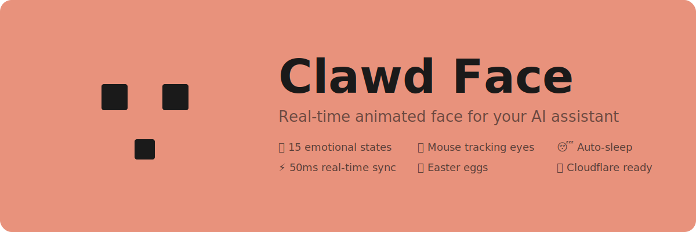
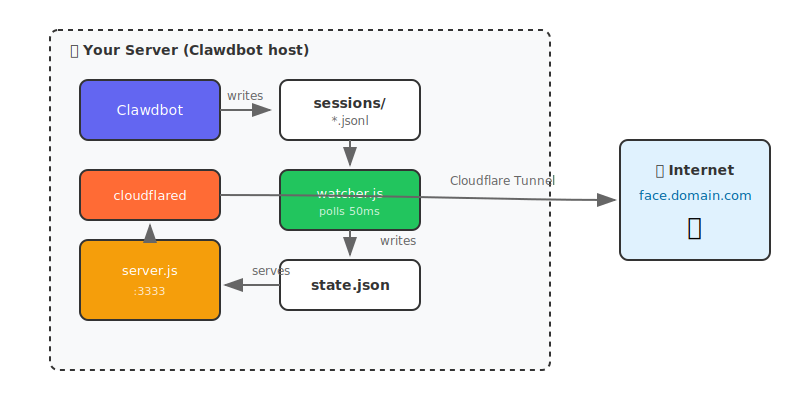

<p align="center">
  
</p>

<p align="center">
  <a href="#-quick-start"></a>
  <a href="#-states"></a>
  <a href="LICENSE"></a>
  <a href="https://github.com/clawdbot/clawdbot"></a>
</p>

<p align="center">
  <b>A real-time animated face for your AI assistant.</b><br>
  Watch Claude think, talk, browse, and code — like a Tamagotchi for your terminal.
</p>

---

## 👀 Preview

<p align="center">
  
</p>

The face automatically reflects what your AI is doing:
- **Coral** → Idle, waiting
- **Blue** → Thinking, reasoning  
- **Green** → Talking, responding
- **Dark Green** → Working, running code
- **Dark** → Sleeping (auto after 5min)

---

## 🚀 Quick Start

### One Command (Recommended)

```bash
npx clawd-face
```

That's it! This will:
- ✅ Auto-detect your Clawdbot installation
- ✅ Start the face server
- ✅ Create a public tunnel
- ✅ Give you a URL to open

```
🤖 Clawd Face

✅ Found Clawdbot at ~/.clawdbot
📍 Starting watcher...
📍 Starting server...
📍 Creating public tunnel...

════════════════════════════════════════════════
  🎉 Clawd Face is live!
  
  Public URL:  https://abc123.loca.lt
  Local URL:   http://localhost:3333
════════════════════════════════════════════════
```

### Alternative: Let Your Claude Do It

Just send this to your Claude:

```
Run npx clawd-face for me and give me the URL
```

### Alternative: Manual Setup

<details>
<summary>Click to expand</summary>

```bash
# 1. Clone
git clone https://github.com/martinbon39/clawd-face-react.git
cd clawd-face-react

# 2. Install & build
npm install && npm run build

# 3. Start
npm start
# Or with pm2 for background:
pm2 start "npm start" --name clawd-face
```

</details>

---

## 🏗️ Architecture

<p align="center">
  
</p>

> **Important:** The watcher must run on the **same server** as Clawdbot because it reads local session files.

---

## 🌐 Expose to Internet

### Cloudflare Tunnel (Recommended)

```bash
# 1. Create tunnel
cloudflared tunnel create clawd-face

# 2. Configure (~/.cloudflared/config.yml)
tunnel: <your-tunnel-id>
credentials-file: ~/.cloudflared/<id>.json
ingress:
  - hostname: face.yourdomain.com
    service: http://localhost:3333
  - service: http_status:404

# 3. Run
pm2 start "cloudflared tunnel run clawd-face" --name clawd-face-tunnel
```

### 🔐 Add Authentication (Recommended)

Protect your face with [Cloudflare Access](https://one.dash.cloudflare.com):

1. **Access** → **Applications** → **Add Application**
2. Enter your hostname: `face.yourdomain.com`
3. **Add Policy** → **Allow** → **Emails** → your email
4. Save — now only you can see the face!

---

## 🎭 All States

| State | Color | When |
|:------|:------|:-----|
| 😐 `idle` | Coral | Nothing happening |
| 🎧 `listening` | Light Green | User sent message |
| 🤔 `thinking` | Blue | Reasoning |
| 💬 `talking` | Green | Responding |
| 💻 `working` | Dark Green | Running commands |
| 🔍 `curious` | Purple | Reading/searching |
| 🎯 `focused` | Navy | Browsing/editing |
| ⚡ `processing` | Indigo | Awaiting results |
| 😊 `happy` | Yellow | Success |
| 🤨 `confused` | Orange | Unexpected |
| 😴 `sleeping` | Dark | 5min inactive |

---

## 🥚 Easter Eggs

| Trigger | Effect |
|:--------|:-------|
| Type `dance` | 🎵 Dance animation |
| Type `love` | ❤️ Floating hearts |
| Type `hello` | 👋 Wave + smile |
| Type `matrix` | 💚 Matrix mode |
| Konami `↑↑↓↓←→←→BA` | ⭐ Stars! |
| Click face 3× | Dance |
| Click face 10× | 🌈 Rainbow |
| `Ctrl+H` | Help panel |
| `Ctrl+D` | Debug panel |

---

## ⚙️ Configuration

### Environment Variables

```bash
# Watcher
SESSIONS_FILE=~/.clawdbot/agents/main/sessions/sessions.json
STATE_FILE=./state.json

# Server
PORT=3333
REACT_DIR=../dist
STATE_FILE=./state.json
```

### Customize Colors

Edit `src/components/ClawdFace/ClawdFace.module.css`:

```css
.idle { background: #E8927C; }
.thinking { background: #7C9FE8; }
.talking { background: #7CE8A3; }
```

### Adjust Timing

```js
// watcher.js
const POLL_INTERVAL = 50;    // Check every 50ms
const IDLE_TIMEOUT = 3500;   // Go idle after 3.5s

// ClawdFace.jsx  
300000  // Sleep after 5 minutes
```

---

## 📁 Project Structure

```
clawd-face-react/
├── src/
│   ├── components/ClawdFace/   # Face component + CSS
│   ├── hooks/useEasterEggs.js  # Fun stuff
│   └── App.jsx
├── watcher/
│   ├── watcher.js              # Monitors Clawdbot
│   └── server.js               # Serves face + state
├── scripts/
│   └── install.sh              # Auto installer
└── dist/                       # Production build
```

---

## 🤝 Contributing

PRs welcome! Some ideas:

- [ ] WebSocket instead of polling
- [ ] Sound effects  
- [ ] Custom face editor
- [ ] Mobile companion app
- [ ] More easter eggs

---

## 📄 License

MIT © [Martin Bonan](https://github.com/martinbon39)

---

<p align="center">
  <sub>Made with ❤️ for the Claude community</sub><br>
  <sub>Put your AI on a second screen and watch it work!</sub>
</p>
